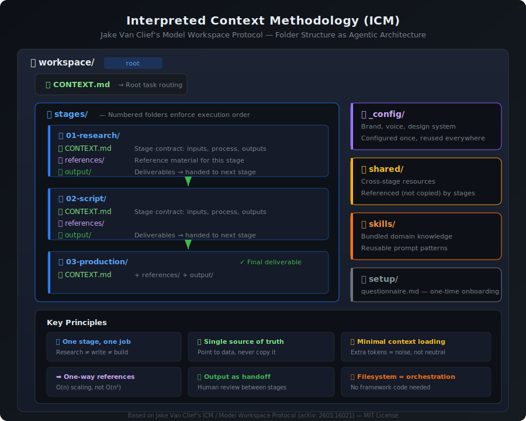
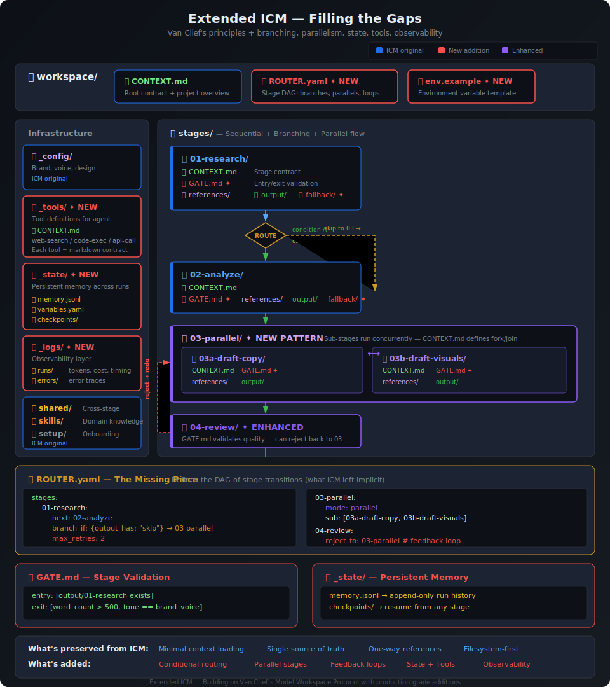

# Albert Mein

I build AI automation systems, mostly LLM-powered agents, retrieval pipelines, and multi-agent setups. Everything here is Python.

## What I'm focused on

I spend most of my time on the applied side of LLMs: getting them to reliably do real work, not just generate text. That means a lot of agent orchestration, retrieval-augmented generation, and figuring out how to make these systems actually production-ready.

**Current areas:**
- Agent orchestration with LangChain/LangGraph and AutoGen
- Multi-agent coordination using CrewAI
- RAG pipelines: document ingestion, chunking strategies, hybrid search
- Unified LLM provider interfaces (OpenAI, Anthropic, Gemini)
- Structured data extraction from unstructured sources

## Repositories

| | |
|---|---|
| [`langchain-ai-automation`](https://github.com/AlbertMein/langchain-ai-automation) | LangChain agents, LCEL chains, and RAG pipelines |
| [`crewai-multi-agent-systems`](https://github.com/AlbertMein/crewai-multi-agent-systems) | Multi-agent task execution with CrewAI |
| [`autogen-agent-framework`](https://github.com/AlbertMein/autogen-agent-framework) | Conversational agent patterns with Microsoft AutoGen |
| [`rag-document-processing`](https://github.com/AlbertMein/rag-document-processing) | Document loaders, vector stores, retrieval strategies |
| [`ai-api-integration`](https://github.com/AlbertMein/ai-api-integration) | Provider-agnostic LLM API wrappers with retry, caching, cost tracking |
| [`data-extraction-automation`](https://github.com/AlbertMein/data-extraction-automation) | Web scraping + LLM-powered structured extraction |
| [`ai-automation-templates`](https://github.com/AlbertMein/ai-automation-templates) | Reusable project scaffolds for AI automation work |

## Stack

**Agent frameworks:** LangChain, LangGraph, CrewAI, AutoGen, LlamaIndex

**LLM providers:** OpenAI, Anthropic, Google AI (Gemini)

**Retrieval & search:** Pinecone, FAISS, Weaviate, pgvector

**Infrastructure:** Python 3.10+, FastAPI, Docker, Pydantic, httpx

## Currently working through

- Long-running agent tasks with persistent memory
- Evaluation frameworks for RAG accuracy (beyond just vibes)
- Cost optimization at scale: batching, caching, model routing
- Moving agent prototypes into production-grade services

## ICM File Structure Reference

I've been exploring Jake Van Clief's [Interpreted Context Methodology](https://arxiv.org/abs/2603.16021) — using folder structure as agentic architecture instead of framework-level orchestration. One agent, sequential stages, markdown contracts at every level.

### Extended ICM — Filling the Gaps

Van Clief's core principles are sound, but the original structure assumes linear, sequential workflows. Real agent pipelines need conditional branching, parallel execution, feedback loops, persistent state, tool integration, and observability. This is my take on extending ICM for production use while keeping the filesystem-first philosophy intact.

**What's added:**
- **`ROUTER.yaml`** — Stage transition DAG with conditional branches, parallel groups, feedback loops, and retry limits. This is the piece ICM left implicit.
- **`GATE.md`** per stage — Entry/exit validation criteria. A stage doesn't start until its gate passes, and doesn't hand off until its output meets quality checks.
- **`fallback/`** directories — Error recovery paths when a stage fails, instead of silent failure.
- **Parallel stage groups** (`03-parallel/` with `03a-`, `03b-` sub-stages) — Concurrent execution with fork/join semantics defined in the parent CONTEXT.md.
- **`_tools/`** — Tool definitions (web search, code execution, API calls) as markdown contracts, giving the agent capabilities beyond text generation.
- **`_state/`** — Persistent memory (`memory.jsonl`), cross-stage variables (`variables.yaml`), and checkpoints for resuming interrupted runs.
- **`_logs/`** — Per-run observability: token usage, cost tracking, timing, and error traces.

